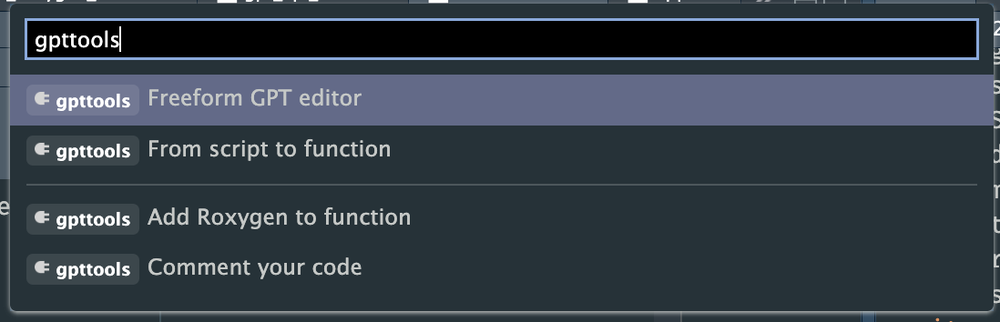

<!-- README.md is generated from README.Rmd. Please edit that file -->

```{r, include = FALSE}
knitr::opts_chunk$set(
  collapse = TRUE,
  comment = "#>",
  fig.path = "man/figures/README-",
  out.width = "100%"
)
```

# gpttools <a href="https://jameshwade.github.io/gpttools/"></a>

<!-- badges: start -->
[](https://www.repostatus.org/#wip)
[](https://CRAN.R-project.org/package=gpttools)
[](https://jameshwade.r-universe.dev)
[](https://app.codecov.io/gh/JamesHWade/gpttools?branch=main)
[](https://lifecycle.r-lib.org/articles/stages.html#experimental)
[](https://github.com/JamesHWade/gpttools/actions/workflows/R-CMD-check.yaml)

[](https://github.com/pre-commit/pre-commit)
<!-- badges: end -->

The goal of gpttools is to extend gptstudio for R package developers to
more easily incorporate use of large language models (LLMs) into their
project workflows. These models appear to be a step change in our use of
text for knowledge work, but you should carefully consider ethical
implications of using these models. Ethics of LLMs (also called
[Foundation Models](https://arxiv.org/abs/2108.07258)) is an area of
very active discussion.

## Installation

### Install from GitHub with `{pak}`

``` r
# install.packages("pak")
pak::pak("JamesHWade/gpttools")
```

### Install from [R-Universe](https://r-universe.dev/)

``` r
# Enable repository from jameshwade
options(repos = c(
  jameshwade = "https://jameshwade.r-universe.dev",
  CRAN = "https://cloud.r-project.org"
))
# Download and install gpttools in R
install.packages("gpttools")
# Browse the gpttools manual pages
help(package = "gpttools")
```

## Privacy Notice for gpttools
This privacy notice is applicable to the R package that utilizes the GPT-3 and GPT-3.5 API provided by OpenAI. By using this package, you agree to adhere to the privacy terms and conditions set by OpenAI.

### Data Sharing with OpenAI
When using this R package, the text or code that you highlight/select with your cursor, or the prompt you enter within the built-in applications, will be sent to OpenAI as part of an API request. This data sharing is governed by the privacy notice, rules, and exceptions that you agreed to with OpenAI when creating an account.

### Security and Data Usage by OpenAI
We cannot guarantee the security of the data you send to OpenAI via the API, nor can we provide details on how OpenAI processes or uses your data. However, OpenAI has stated that they utilize prompts and results to enhance their AI models, as outlined in their terms of use. You can opt-out of this data usage by contacting OpenAI directly and making an explicit request.

### Limiting Data Sharing
The R package is designed to share only the text or code that you specifically highlight/select or include in a prompt through our built-in applications. No other elements of your R environment will be shared. It is your responsibility to ensure that you do not accidentally share sensitive data with OpenAI.

**IMPORTANT: To maintain the privacy of your data, do not highlight, include in a prompt, or otherwise upload any sensitive data, code, or text that should remain confidential.**


## Prerequisites

1.  Make an OpenAI account.

2.  [Create an OpenAI API key](https://platform.openai.com/account/api-keys) to use with the package.

3.  Set the API key up in Rstudio

### Setting OpenAI API Key

By default, API calls will look for `OPENAI_API_KEY` environment variable. If you want to set a global environment variable, you can use the following command, where `"<APIKEY>"` should be replaced with your actual key:

```{r}
#| eval: false
Sys.setenv(OPENAI_API_KEY = "<APIKEY>")
```

Otherwise, you can add the key to the .Renviron file of the project. The following commands will open .Renviron for editing:

```{r}
#| eval: false
require(usethis)
edit_r_environ(scope = "project")
```

You can add the following line to .Renviron (again, replace `"<APIKEY>"` with your actual key):

``` bash
OPENAI_API_KEY= "<APIKEY>")
```

This now set the API key every time you start up this particular project. Note: If you are using GitHub/Gitlab, do not forget to add .Renviron to .gitignore!

## Usage

The package has four addins:

-   Comment code: uses code-davinci-edit-001 model from OpenAI to add
comments to your code with the prompt: "add comments to each line of
code, explaining what the code does"

-   Add roxygen: uses text-davinci-003 model from OpenAI to add and fill
out a roxygen skeleton to your highlight code (should be a function)
with the prompt: "insert roxygen skeleton to document this function"

-   Convert script to function: uses code-davinci-edit-001 model from
OpenAI to convert a highlighted script into a function with the
prompt: "convert this R code into an R function"

-   Write a unit test for a function with testthat: uses
text-davinci-003 model from OpenAI to suggest a unit test for a
selected function with the prompt: "Suggest a unit text for this
function using the testthat package"

-   A freeform addins that let's you specify the prompt using the "edit"
functionality of ChatGPT

You can access these addins through the addin toolbar or use the command
pallet: `CMD/CTRL+SHIFT+P`. Examples of each of the addins in action is
below.



### Comment Code

<video src="https://user-images.githubusercontent.com/6314313/209890944-3d6a00fa-2d8c-4df7-8a11-f5a5ec3a1391.mov" data-canonical-src="https://user-images.githubusercontent.com/6314313/209890944-3d6a00fa-2d8c-4df7-8a11-f5a5ec3a1391.mov" controls="controls" muted="muted" class="d-block rounded-bottom-2 width-fit" style="max-height:640px;">

</video>

### Add Roxygen

<video src="https://user-images.githubusercontent.com/6314313/209890939-ebd7afea-7d68-40b4-b482-b3fe51485ab1.mov" data-canonical-src="https://user-images.githubusercontent.com/6314313/209890939-ebd7afea-7d68-40b4-b482-b3fe51485ab1.mov" controls="controls" muted="muted" class="d-block rounded-bottom-2 width-fit" style="max-height:640px;">

</video>

### Convert a Script into Functions

<video src="https://user-images.githubusercontent.com/6314313/209890949-4da2bdd7-bcac-4769-9b11-7759b4abb760.mov" data-canonical-src="https://user-images.githubusercontent.com/6314313/209890949-4da2bdd7-bcac-4769-9b11-7759b4abb760.mov" controls="controls" muted="muted" class="d-block rounded-bottom-2 width-fit" style="max-height:640px;">

</video>

### Suggest a Unit Test for a Function

<video src="https://user-images.githubusercontent.com/6314313/209890959-fca623d9-5e8e-463c-ac64-80f3db9875d9.mov" data-canonical-src="https://user-images.githubusercontent.com/6314313/209890959-fca623d9-5e8e-463c-ac64-80f3db9875d9.mov" controls="controls" muted="muted" class="d-block rounded-bottom-2 width-fit" style="max-height:640px;">

</video>

## Code of Conduct

Please note that the gpttools project is released with a [Contributor
Code of
Conduct](https://jameshwade.github.io/gpttools/CODE_OF_CONDUCT.html). By
contributing to this project, you agree to abide by its terms.
